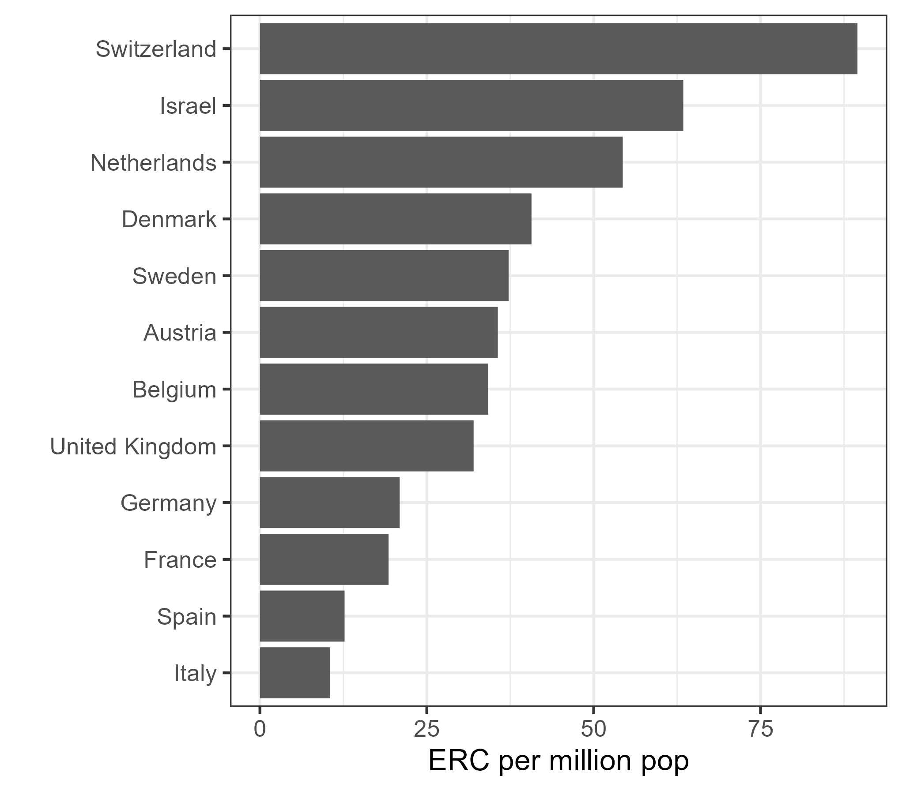

# ERC_inflow_outflow

Fork of <https://github.com/paolocrosetto/ERC_inflow_outflow>

## Dependencies

The script depends on `tidyverse`, `OECD` and `countrycode` (which is cool)

## Data

Data were shared by the ERC based on official ERC data, aggregated over several years to ensure the privacy of PIs.

## Plots

ERC grants per capita of host countries, for the 12 biggest hosting countries

Looking at populations of EU28+ trying to see which countries with larger populations not represented in ERC hosting

